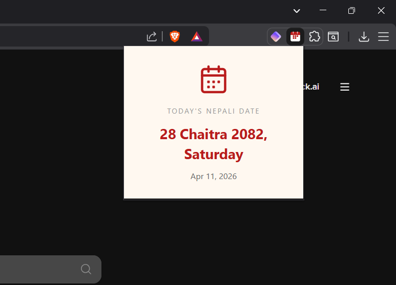

# BS-Extension
A simple chrome extension to display todays date in BS 

# How it works 
The website grabs more so steals data from [HamroPatro](https://www.hamropatro.com/) and just displays the Date in the extension, very simple.

# How to use it
1. Download the files from [here](https://github.com/sam4duh/BS-Extension/archive/refs/heads/main.zip) or clone the repo, 
2. Go to chrome://extensions,
3. Enable the developer mode,
4. On the Top-Left click "Load unpacked" and select the BS-Extension folder
5. Done.

---
*last update ( UTC+05:45 ): 11:55 AM, April 13, 2026*
